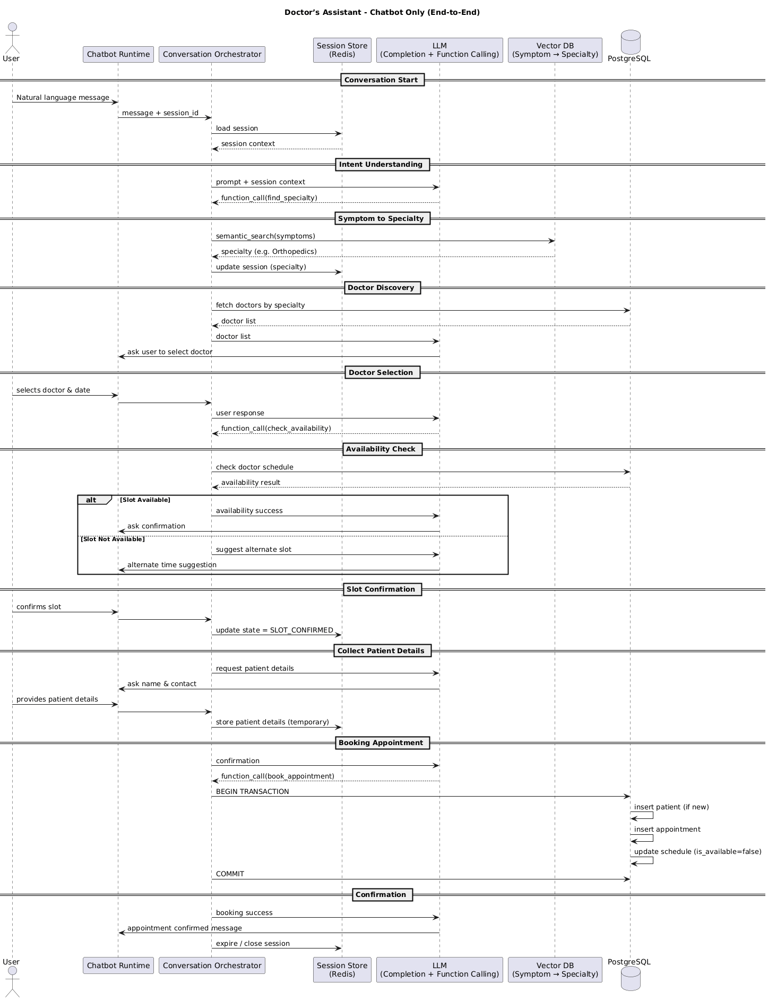

Doctor's Assistant 
**Overview**
This document describes the end-to-end sequence flow for the Doctor's Assistant chatbot.

This system is a chatbot-only application that

* Accepts natural language user messages.
* Uses LLM completion API with function calling
* Uses Vector Database for symptom check
* Maintains conversation state using sessions
* Books doctor appointment transactionally in PostgreSQL

Sequence Diagaram

```plantuml
@startuml
title Doctor’s Assistant – Chatbot Only (End-to-End)

actor User
participant "Chatbot Runtime" as Bot
participant "Conversation Orchestrator" as CO
participant "Session Store\n(Redis)" as SS
participant "LLM\n(Completion + Function Calling)" as LLM
participant "Vector DB\n(Symptom → Specialty)" as VDB
database "PostgreSQL" as DB

== Conversation Start ==
User -> Bot : Natural language message
Bot -> CO : message + session_id
CO -> SS : load session
SS --> CO : session context

== Intent Understanding ==
CO -> LLM : prompt + session context
LLM --> CO : function_call(find_specialty)

== Symptom to Specialty ==
CO -> VDB : semantic_search(symptoms)
VDB --> CO : specialty (e.g. Orthopedics)
CO -> SS : update session (specialty)

== Doctor Discovery ==
CO -> DB : fetch doctors by specialty
DB --> CO : doctor list
CO -> LLM : doctor list
LLM -> Bot : ask user to select doctor

== Doctor Selection ==
User -> Bot : selects doctor & date
Bot -> CO
CO -> LLM : user response
LLM --> CO : function_call(check_availability)

== Availability Check ==
CO -> DB : check doctor schedule
DB --> CO : availability result

alt Slot Available
    CO -> LLM : availability success
    LLM -> Bot : ask confirmation
else Slot Not Available
    CO -> LLM : suggest alternate slot
    LLM -> Bot : alternate time suggestion
end

== Slot Confirmation ==
User -> Bot : confirms slot
Bot -> CO
CO -> SS : update state = SLOT_CONFIRMED

== Collect Patient Details ==
CO -> LLM : request patient details
LLM -> Bot : ask name & contact
User -> Bot : provides patient details
Bot -> CO
CO -> SS : store patient details (temporary)

== Booking Appointment ==
CO -> LLM : confirmation
LLM --> CO : function_call(book_appointment)

CO -> DB : BEGIN TRANSACTION
DB -> DB : insert patient (if new)
DB -> DB : insert appointment
DB -> DB : update schedule (is_available=false)
CO -> DB : COMMIT

== Confirmation ==
CO -> LLM : booking success
LLM -> Bot : appointment confirmed message
CO -> SS : expire / close session

@enduml

Sequence Diagram 


